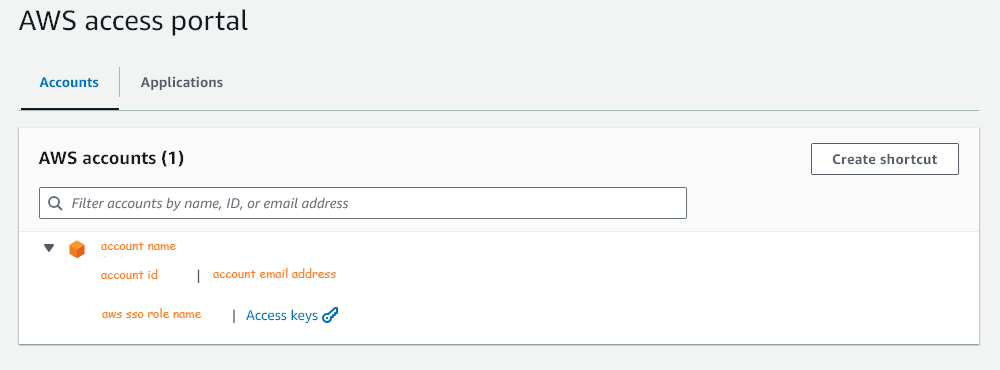
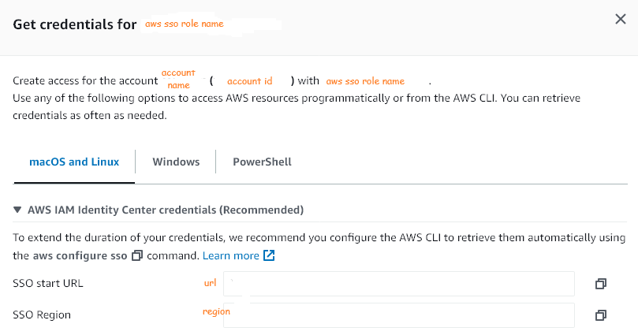

# Local, GitHub, Amazon

After connecting to an Amazon Web Services (AWS) account, directly or via an identity service, the `AWS access portal` screen appears.  The details therein are critical to setting up programmatic, and continuous integation, access to AWS directly, and via GitHub; we will require more details later.

## AWS CLI

### Key Parameters & Arguments



The key values of the `aws configure` parameters are set via the directives below.  Use the image above, and below, to determine most of the parameter values, i.e., the values in brackets. 

```shell
aws configure set sso_session {sso.session.string} --profile default
aws configure set sso_account_id {account id} --profile default
aws configure set sso_role_name {aws sso role name} --profile default
aws configure set region {region} --profile default

# Refer to the notes below
aws configure set output {output.string} --profile default
```

Notes: 
* The value of the `sso_session` parameter is user dependent.  It is a string that names a session, e.g., to name a session `alpha`
  > aws configure set sso_session **alpha** --profile default

* `aws configure` output [options](https://docs.aws.amazon.com/cli/latest/userguide/cli-configure-files.html#cli-config-output).  Example
  > aws configure set output **json** --profile default

<br>
<br>

### Single Sign On (SSO)

The image above has a link names Access keys; each account within a portal page will have its own access keys link.  Within your AWS access portal, click on the Access keys link of the account of interest.  A pop-up, similar to   




Type

```shell
aws configure sso
```


SSO session name [sso.session.string]: {sso.session.string}
SSO start URL [None]: {url}
SSO region [None]: {region}
SSO registration scopes [sso:account:access]: sso:account:access


* <a href="https://docs.aws.amazon.com/cli/latest/userguide/cli-configure-sso.html"><abbr title="Amazon Web Services">AWS</abbr> <abbr title="Command Line Interface">CLI</abbr> with <abbr title="Identity & Access Management">IAM</abbr> Identity Centre</a>
* [IAM (Identity & Access Management) Roles](https://docs.aws.amazon.com/IAM/latest/UserGuide/id_roles.html)
* [Amazon Web Services Managed Policies](https://docs.aws.amazon.com/aws-managed-policy/latest/reference/policy-list.html)
* [Changing or setting a region](https://docs.aws.amazon.com/awsconsolehelpdocs/latest/gsg/select-region.html)
